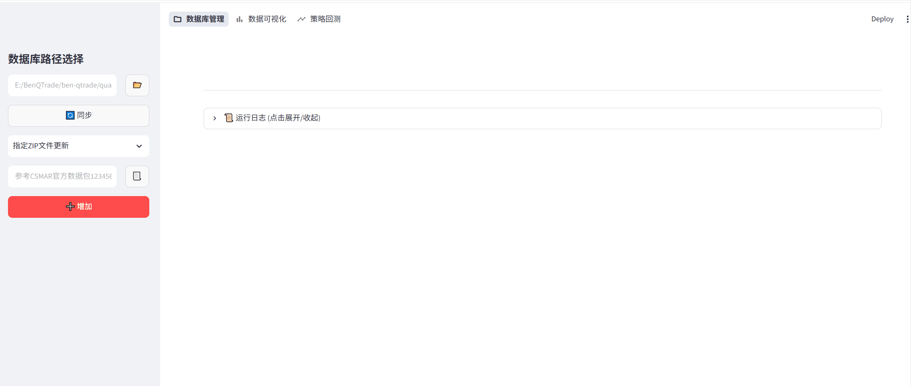
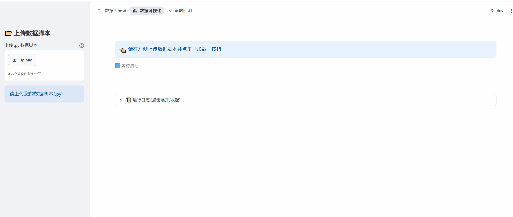
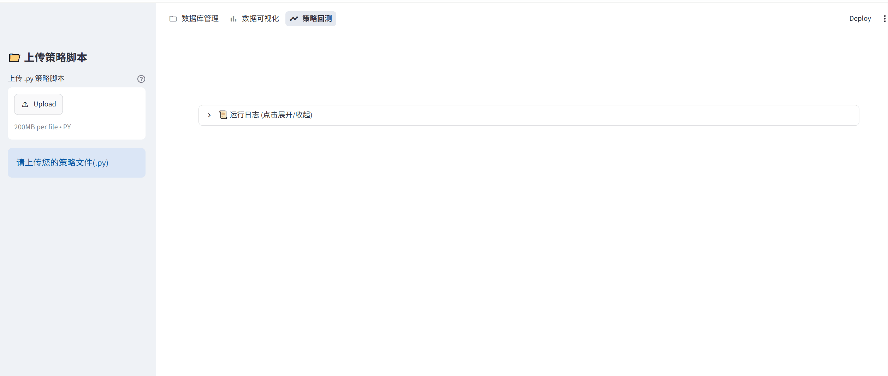

# 量化交易WebUI框架

## 1.项目介绍

这是一个面向量化交易的多功能WebUI开发框架，自己开发调试用的分享出来，面向有一定编程基础的量化交易开发者，设计模式上采用了自定义脚本植入方式，能够方便开发者编写相应的PY代码脚本后，加载到该WebUI开发框架中，实现自由度更高的数据回测可视化交互。

本项目当前V0.1.0版本，支持开发者进行本地数据库管理维护，数据可视化以及量化回测，每个功能对应一个导航页，下面来分别介绍每个功能的基本使用。

### 1.1 数据库管理

数据管理库页面展示如下所示：



该功能主要是将ZIP、CSV和PARQUET这几种数据格式内容，合并导入到本地数据库中，统一以PARQUET形式存储，并登记在数据库meta.json元数据文件下进行管理，支持单包导入、多包导入和整个文件夹导入。

其中ZIP包要求是符合国泰安CSMAR格式的ZIP标准数据包，CSV和PARQUET在选择多个包时，会提取关键名(下划线、空格、短划线等前面那个名字)，然后根据相同关键名进行包合并。

由于是PARQUET格式作为本地离线数据库，开发者可以自行使用SQL进行维护开发。

通过该功能，就得到了用于后续分析的轻量级本地数据库。

### 1.2数据可视化

数据可视化页面展示如下：



用法就是上传编写好的数据脚本，然后选择要显示的那个数据脚本进行加载，即可得到相应的交互图像。

这个交互图像中的均线、筹码图等内容，都是在数据脚本中由开发者编写定义，数据内容取自数据。

如果对某些可视化指标不满意，或者想增减曲线，可以清空后上传修改后的PY文件，相应内容会在重新渲染同步。

### 1.3 策略回测

策略回测页面展示如下：



策略回测是针对数据可视化中加载的数据集，匹配相应的交易策略来回测。

也需要开发者事先写好策略脚本，上传之后选择加载，加载后匹配回测数据源，设置好回测参数后开始回测。

回测结果包含八个常用指标，资金变化曲线，各个交易对象的每笔交易信息，以及数据源可视化图像。

如果在PY文件中修改了策略，可以清空后重新上传再回测。

## 2.使用介绍

首先确保安装了相应依赖。

```bash
pip install -r requirements.txt
```

再启动下列指令：

```bash
streamlit run quant_trade_webui.py
```

在交互界面中按照前面介绍，自行给数据库添加数据，参考数据库在example_database下。

上传数据可视化脚本和策略策略回测脚本，参考脚本都在example_pys下，可能需要根据本地环境修改下内部相关路径。

数据可视化脚本涉及到的两个数据包较大，参见百度网盘：
https://pan.baidu.com/s/1g3ZdiKmrvO6MzRNgFkAAag 提取码: Ming

上述步骤完成后，在交互界面执行数据可视化和策略回测。

## 3.脚本编写

### 3.1数据可视化脚本编写

首先是继承基类DataFramePlotter，模块加载识别部分，都是基于DataFramePlotter的继承类来识别的。

```python
class DataframePlotterExample0(DataFramePlotter):
```

然后在构造函数中，获取dataframe格式数据源，我这里用了DatabaseParser()类从本地维护的数据库中获取，核心获取函数就是这个create_df_from_database，它会根据data_col_list在整个数据库中搜索字段，然后提取整一列下来组合，database_dir则是给入你的本地数据库地址，data_preferfile_dict则是不同数据包中出现有重复字段列时，优先用哪个数据包里面的，不指定则默认使用首次匹配的列名，file_sql_appendcmd则是支持加入额外的SQL命令字段，可以预处理一下提取内容，防止提取数据过多。

```python
def create_df_from_database(
    self,
    data_col_list: list[str],
    database_dir: str,
    data_preferfile_dict: dict = {},
    file_sql_appendcmd: dict = {},
):
```

当然你也可以用AKSHARE、TUSHARE或者其他方式作为数据源，本质上就是获得准备绘图用的dataframe。

有了dataframe后，使用基类构造，这个构造和backtrader构建bt.feeds.PandasData很接近，此处不过多说明。

```python
super().__init__(
    name="上证指数",
    df=merged_df,
    open_col="开盘指数",
    high_col="最高指数",
    low_col="最低指数",
    close_col="收盘指数",
    time_start=time_start,
    time_end=time_end,
)
```

构造完数据后，需要开发者在子类中实现create_fig，这个就是核心绘图函数。

它本质上就是在Plotly的go.Figure对象上添加不同曲线元素，这里我在基类中按照常用证券交易界面，定义好了布局，开发者只需要用如下函数接口添加图像，依次是加K线、折线、柱状、散点和时变柱状分布图。

```python
def add_candlestick_to_plot(self, name: str, y_axis: str = "y"): 
def add_line_to_plot(self, series: pd.Series, y_axis: str):
def add_bar_to_plot(self, series: pd.Series, y_axis: str = "y2", colors_list: list = []):
def add_point_to_plot(self, series: pd.Series, y_axis: str, colors_list=[], symbols_list=[]):
def add_dynamic_bar_to_plot(
        self,
        name,
        time_index: pd.DatetimeIndex,
        price_center_array: np.ndarray,
        chip_2d_array: np.ndarray,
        threholds_value_array: np.ndarray,
        greater_pos_color_flag: bool,
    ):
```

fig中默认会自动加上time_start和time_end之间的K线，其他需要自行添加，y_axis则是表示加在图片哪个轴上，y是上主图，y2下副图，y3是右下角辅图，具体每个参数定义可以参看代码注释。

为了方便绘图，dataframe_plotter.py中还预先编写了一些指标计算函数，开发者也可以用talib根据需求自行编写。

通过该步骤对fig添加绘图元素，最终会渲染到WebUI的数据可视化和策略回测界面上交互。

### 3.3回测策略脚本编写

回测策略写法和backtrader的bt.Strategy基本上没什么区别，但有几点小改动。

首先是继承类要写成：

```python
class StrategyExample0(ExtBtStrategy):
```

这个ExtBtStrategy我在bt.Strategy基础上加装了一些回测统计的功能，比如统计每笔交易信息。

其次是构造时要传入如下所示的DataframePlotter对象列表：

```python
def __init__(self,dataframe_plotters=[]):
    super().__init__(dataframe_plotters)
```

这个DataframePlotter就是在策略回测UI界面，选择的那几个数据源，顺序和数据源也和选择顺序一致，这样可以在策略内部访问前面数据脚本中处理好的数据信息。

这个DataframePlotter也会与bt.feeds.PandaData做映射，它会把原始K线数据加入到Backtrader回测引擎中，因此也支持在回测策略中用self.datas[n]来访问。

其他写法，包括重写next、重写notify_trade之类的功能，和bt.Strategy用法完全一样，这里不过多赘述。


BY: Dr.Ming

Email: benxxxf@qq.com

2026.8.25